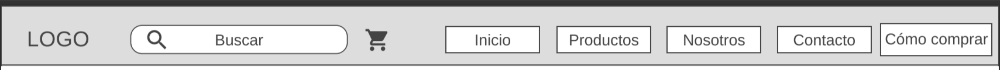
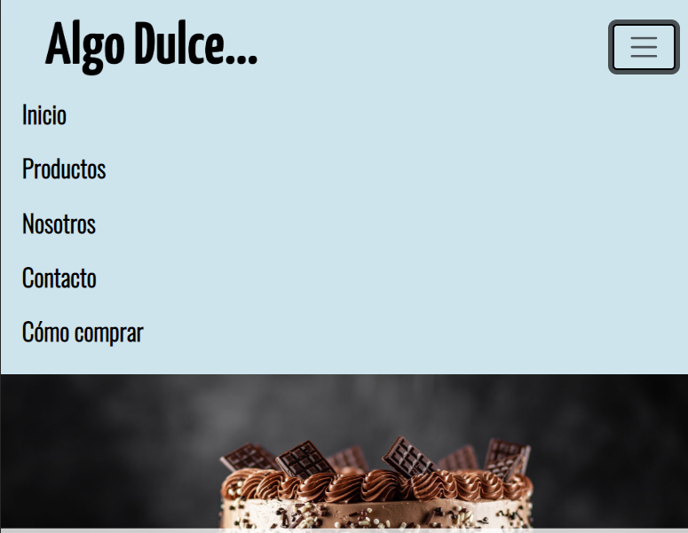
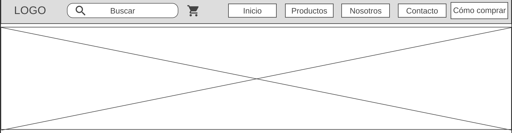
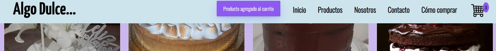

# Proyecto Final de Desarrollo Web por Iván Roth

## Introducción

Este proyecto fue realizado para la entrega final del curso de desarrollo web de CoderHouse. El sitio web es sobre una pastelería llamada
"Algo Dulce", la cual está desarrollada con HTML, CSS, JavaScript y el uso de frameworks como SASS, BOOTSTRAP
y NODE.JS. También se utilizó GIT para el uso de control de versiones y GitHub como repositorio.

## Sobre mí

Mí pasión por la programación y el desarrollo web comenzó en 2020, en plena cuarentena, cuando descubrí varios canales en YouTube
dedicados a tocar estos temas. Empecé a ver muchos videos de programación al día, y una vez que descubrí sus diferentes ramas
me di cuenta que lo que más me gustaba era el desarrollo web. Estaba cursando la carrera de licenciatura en
Comunicación, y por temas de horario no pude dedicarle el tiempo que me hubiera gustado, solo realicé unos cursos gratuitos de algunos creadores de contenido.

Ahora que ya me recibí, me animé a anotarme al curso de desarrollo web de CoderHouse y la idea es que este sea el puntapié inicial para
llegar a ser desarrollador full stack.

## Proceso de creación

La elección de hacer el sitio web sobre una pastelería se debe a que mi madre siempre tuvo pasión por la gastronomía (sobre todo por las cosas
dulces) y su sueño era vender sus tortas y demás postres. En 2019 cumplió ese sueño de tener su pastelería propia, pero se vio 
afectado por el Covid y la cuarentena. Con el cierre de su pastelería comenzó a vender sus tortas a través de su cuenta de Instagram,
sin embargo no tenía una página web para promocionarse mejor. Por lo tanto, ahora que tengo ciertos conocimientos en el desarrollo web decidí 
regalarle un sitio web sobre su pastelería, la cual irá mejorando con los años y los nuevos conocimientos que vaya adquiriendo sobre la 
programación.

# Inicio del desarrollo del sitio

Al principio hice varios wireframes para tener una idea de por donde encarar el comienzo del sitio. El resultado final terminó siendo
diferente a los wireframes, pero esto era algo que esperaba debido a mis pocos conocimientos en la materia a la hora de empezar a escribir
código. De todas formas, creo que el resultado final terminó siendo mejor de lo que me esperaba y eso es algo de lo que me siento
orgulloso.

## Navbar

Así era la navbar en el wireframe:

y así terminó quedando:

Para vista mobile y todo tipo de pantalla con una resolución menor a 992px le puse un menú desplegable utilizando Bootstrap:

## Cuerpo del sitio

En el inicio tenía pensado agregar una imagen de header pero luego me decidí por hacer un carrusel de imágenes, que me terminó gustando
más.

Imagen del header del wireframe:

Imagen carrusel:

En el contenido de los artículos de la página de inicio utilicé las cards y el sistema de grillas de Bootstrap:

En el contenido de los artículos en la página de productos usé Grid, ya que quería practicar su uso:

También use media queries con Grid para hacer el diseño responsive:

## Footer

En cuanto al footer sí quedó bastante fiel al diseño del wireframe:

Footer del wireframe:

Footer del sitio:

## JavaScript

Usé JavaScript para mejorar la interactividad y la experiencia del usuario. Cada vez que se clickea el botón de 'Agregar al carrito'
aparecerá una alerta indicando que el producto fue agregado al carrito y aparecerá el número arriba del carrito de compras la cantidad
de prodcutos que hay en el.

## Las otras páginas y responsive

El sitio web cuenta con otras páginas de "contacto", "sobre nosotros" y "cómo comprar". Todo el sitio web se puede ver tanto en escritorio
como en tablet y mobile.

# Lenguajes y tecnologías usados

## Lenguajes

## Otras tecnologias

## Sistema de control de versiones

## Links

Link del deployment de Github pages:
https://ivanroth000.github.io/mi-primer-repositorio/

Link de mi dominio en vercel:
https://algodulce.vercel.app/

Muchas gracias por leer 😊.
